# Project Management System
## All-in-One Technical and System Documentation

**Version:** 1.0  
**Date:** September 2026  
**Repository:** SABABISHA-PMS  
**Status:** Backend, web, QA, and DevOps scope documented. Flutter mobile is intentionally deferred.

---

## 1. Executive Summary

The Project Management System is a multi-tenant platform for organizations, projects, tasks, collaboration, notifications, and dashboard reporting. Users belong to organizations and can participate in projects through explicit project memberships and roles.

The current implementation uses an ASP.NET Core .NET 8 API, SQL Server 2022, Entity Framework Core 8, Dapper 2.x, HotChocolate GraphQL 14.3, and a React 18.3/Vite 5 web client. REST endpoints are versioned under `/api/v1`. GraphQL is exposed at `/graphql`.

SQL Server is the selected primary physical database for the bootcamp implementation. PostgreSQL remains an alternative design option and is not silently mixed into the SQL Server implementation.

### Current implementation scope

- Authentication and refresh tokens
- Organizations, invitations, and organization roles
- Projects and project memberships
- Tasks, multiple assignees, statuses, priorities, and dates
- Comments, replies, mentions, and attachments
- Notifications
- Dashboard metrics through a Dapper stored-procedure repository
- React web application with Axios, Material UI, Apollo Client, and TanStack Query foundations
- Docker Compose for SQL Server, API, and web services
- GitHub Actions validation workflow
- Postman/Newman-compatible API collection

### Deferred scope

- Flutter mobile application
- PostgreSQL provider implementation
- Production provider credentials and environment-specific deployment configuration
- Full automated test suite and enforced 80% coverage threshold

---

## 2. Goals and Non-Goals

### Goals

1. Provide secure organization and project isolation.
2. Support project planning and task execution.
3. Support multiple assignees per task.
4. Provide collaboration and notification workflows.
5. Expose REST and GraphQL integration points.
6. Support repeatable local development and CI validation.
7. Preserve a clear path toward mobile and cloud deployment.

### Non-goals for the current release

- Building the Flutter mobile application.
- Supporting SQL Server and PostgreSQL simultaneously without provider-specific testing.
- Claiming completion of external process evidence such as Jira, Figma, HackerRank, or UAT records that are not stored in this repository.

---

## 3. Technology Stack

| Area | Selected technology | Status |
|---|---|---|
| Backend | .NET 8 LTS, ASP.NET Core Web API | Implemented |
| ORM | Entity Framework Core 8 | Implemented |
| Optimized data access | Dapper 2.x | Implemented for dashboard metrics |
| API | REST `/api/v1`, HotChocolate GraphQL 14.3 | Implemented |
| Primary database | SQL Server 2022 | Implemented |
| Frontend | React 18.3, Vite 5 | Implemented |
| UI | Material UI 6 | Theme and dependency integrated |
| REST client | Axios | Implemented |
| REST state/query layer | TanStack Query 5 | Notifications migrated |
| GraphQL client | Apollo Client 4 | Client/provider integrated |
| Mobile | Flutter 3.19+, Dart 3, GraphQL Flutter | Deferred |
| Containers | Docker and Docker Compose | SQL Server, API, and web services defined |
| CI | GitHub Actions | Build/test workflow defined |
| API testing | Postman/Newman | Collection and environment provided |
| Runtime version | Node 20 target | `.nvmrc` and package engines configured |

---

## 4. System Context

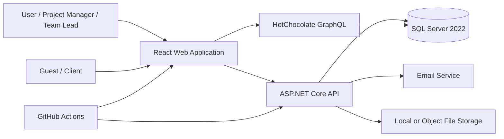

### External actors

| Actor | Responsibilities |
|---|---|
| User | Registers, authenticates, manages organizations, projects, tasks, and collaboration. |
| Project Manager | Creates projects, manages project members, creates tasks, and controls project work. |
| Team Lead | Coordinates project work and may manage project members and tasks. |
| Contributor | Works on assigned project tasks and collaboration. |
| Viewer | Reads project information without write access. |
| Guest / Client | Limited organization access and viewer-only project participation. |
| External email service | Delivers invitation, reset, and notification messages. |

---

## 5. Layered Architecture

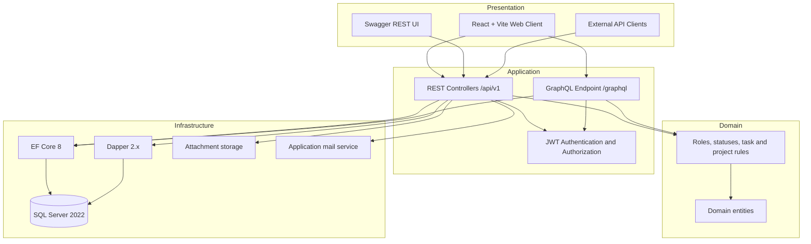

### Repository ownership

- `src/Pms.Api`: API entry point, controllers, authentication, GraphQL.
- `src/Pms.Application`: application use cases and service boundaries.
- `src/Pms.Domain`: entities, enums, and domain concepts.
- `src/Pms.Infrastructure`: EF Core context, Dapper access, SQL Server integration, and external services.
- `apps/web`: React/Vite browser client.
- `database/sqlserver`: schema, procedures, indexes, seed data.
- `tests`: unit, integration, API, browser, and smoke-test surfaces.
- `infrastructure/docker`: Dockerfiles, Compose, and web server configuration.

---

## 6. Data Flow Diagram

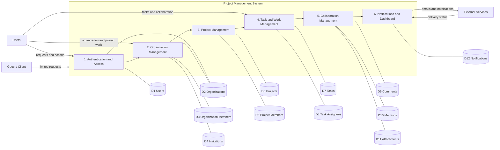

### Main data flows

| Source | Flow | Destination |
|---|---|---|
| User | Requests and actions | API and web application |
| API | Responses and data | User |
| Guest | Limited requests | API |
| API | Emails and notifications | External services |
| External services | Delivery status | Notification processing |

---

## 7. Authentication and Authorization

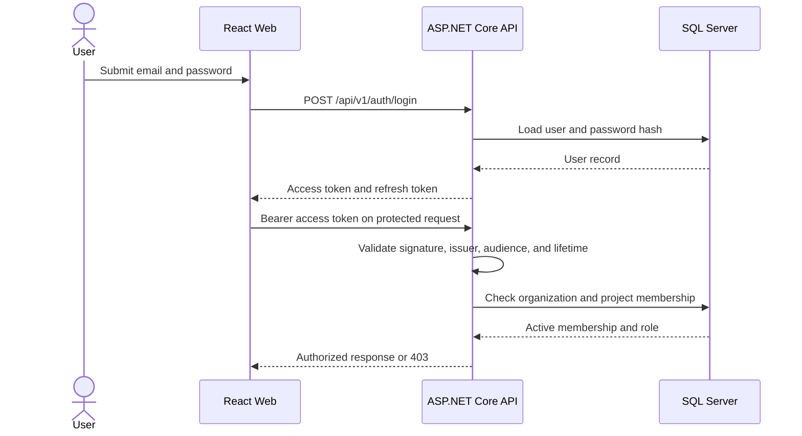

### Organization roles

| Role | Intended permission |
|---|---|
| OWNER | Full organization control; cannot be demoted through normal role update. |
| ADMIN | Manage members, roles, invitations, and organization resources. |
| MEMBER | Normal organization participation. |
| GUEST | Limited access; viewer-only project participation. |

### Project roles

| Role | Intended permission |
|---|---|
| PROJECT_MANAGER | Manage project settings, members, and tasks. |
| TEAM_LEAD | Coordinate project work and manage project members/tasks. |
| CONTRIBUTOR | Create and update tasks, comments, and attachments. |
| VIEWER | Read-only project access. |

### Authorization rules

1. Authentication is required for protected REST and GraphQL operations.
2. Project access requires active project membership.
3. Project access also requires active organization membership.
4. Organization guests cannot retain manager-level project privileges.
5. Viewers cannot write tasks, comments, or attachments.
6. Task deletion is restricted to project managers and team leads.
7. Archived projects are excluded from active task and collaboration access.
8. Attachment downloads are checked against task project access.
9. Notifications are filtered by recipient user ID.
10. Authorization is enforced by the API and is not delegated to frontend visibility rules.

---

## 8. Create Task and Assign Multiple Users

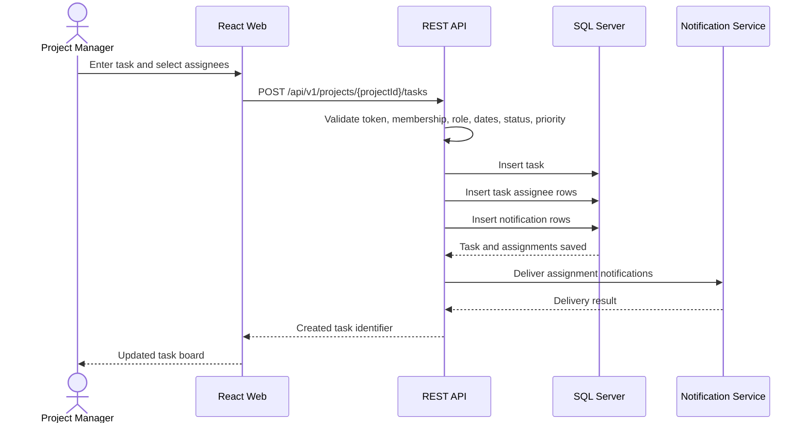

The SQL Server procedure `usp_CreateTaskWithAssignees` provides a database-level transaction path for task creation, assignee insertion, and notification creation. The REST controller currently validates the same business constraints through EF Core.

---

## 9. Entity Relationship Diagram

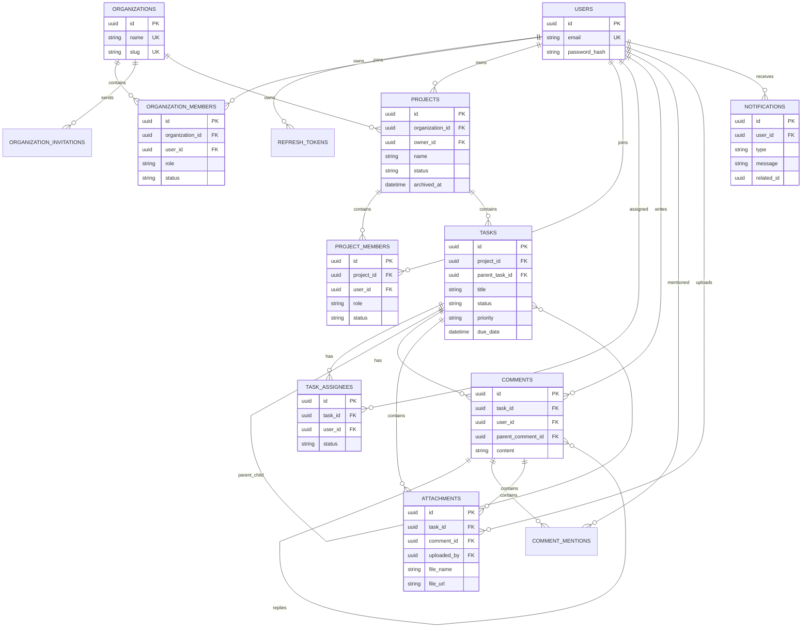

### Data integrity rules

- Organization membership uses a unique organization/user pair.
- Project membership uses a unique project/user pair.
- Task assignees use a unique task/user pair.
- User emails, organization names, organization slugs, refresh token hashes, and invitation token hashes are unique.
- Tasks may reference a parent task for subtasks.
- Comments may reference a parent comment for replies.
- Attachments may reference a task or comment.
- Soft deletion is used for tasks and selected collaboration records.

---

## 10. API Contract

### Authentication

| Method | Endpoint | Purpose |
|---|---|---|
| POST | `/api/v1/auth/register` | Create an account. |
| POST | `/api/v1/auth/login` | Issue access and refresh tokens. |
| POST | `/api/v1/auth/refresh` | Rotate or renew authentication tokens. |
| POST | `/api/v1/auth/logout` | Revoke a refresh token. |
| POST | `/api/v1/auth/forgot-password` | Request a password reset. |
| POST | `/api/v1/auth/reset-password` | Set a new password. |

### Organizations

| Method | Endpoint | Purpose |
|---|---|---|
| GET | `/api/v1/organizations` | List active organizations for the current user. |
| POST | `/api/v1/organizations` | Create an organization and owner membership. |
| GET | `/api/v1/organizations/{id}/members` | List active organization members. |
| PATCH | `/api/v1/organizations/{id}/members/{userId}` | Change an organization role. |
| GET | `/api/v1/organizations/{id}/invitations` | List pending invitations. |
| POST | `/api/v1/organizations/{id}/invitations` | Send an invitation. |
| POST | `/api/v1/organizations/invitations/accept` | Accept an invitation. |

### Projects and tasks

| Method | Endpoint | Purpose |
|---|---|---|
| GET | `/api/v1/projects?organizationId={id}` | List active projects accessible to the user. |
| POST | `/api/v1/projects` | Create a project. |
| GET | `/api/v1/projects/{id}` | Get a project. |
| PATCH | `/api/v1/projects/{id}` | Update a project. |
| DELETE | `/api/v1/projects/{id}` | Archive a project. |
| GET | `/api/v1/projects/{id}/members` | List project members. |
| POST | `/api/v1/projects/{id}/members` | Add a project member. |
| POST | `/api/v1/projects/{id}/tasks` | Create a task with multiple assignees. |
| GET | `/api/v1/tasks?projectId={id}` | List project tasks. |
| PATCH | `/api/v1/tasks/{id}` | Update task fields or assignees. |
| DELETE | `/api/v1/tasks/{id}` | Soft-delete a task. |
| GET | `/api/v1/dashboard/metrics?projectId={id}` | Get Dapper-backed dashboard metrics. |

### Collaboration and notifications

| Method | Endpoint | Purpose |
|---|---|---|
| GET/POST | `/api/v1/tasks/{id}/comments` | Read or create comments and replies. |
| GET/POST | `/api/v1/tasks/{id}/attachments` | List or upload attachments. |
| GET | `/api/v1/attachments/{id}/download` | Download an authorized attachment. |
| GET | `/api/v1/notifications` | List current-user notifications. |
| PATCH | `/api/v1/notifications/{id}/read` | Mark one notification read. |
| PATCH | `/api/v1/notifications/read-all` | Mark all notifications read. |

### GraphQL

GraphQL is available at `/graphql` and requires authentication. The current schema exposes authenticated service metadata and provides the integration point for future domain queries and mutations.

Example request:

```json
{
  "query": "{ serviceName version }"
}
```

### Standard errors

```json
{
  "success": false,
  "error": {
    "code": "ERROR_CODE",
    "message": "Human readable message",
    "details": {}
  }
}
```

Expected status meanings: `401` unauthenticated, `403` forbidden, `404` not found, `409` conflict, `422` validation failure, `429` rate limited, and `500` server error.

---

## 11. Dashboard Metrics

The Dapper repository calls `usp_GetDashboardMetrics` with the current user ID and an optional project ID. Metrics include:

- My tasks
- Overdue tasks
- Completed tasks
- In-progress tasks
- Total tasks

Project-scoped metrics require active organization and project membership. Archived projects are rejected.

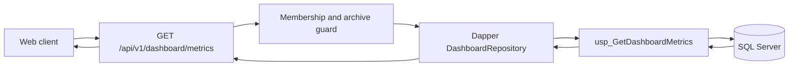

---

## 12. Deployment Architecture

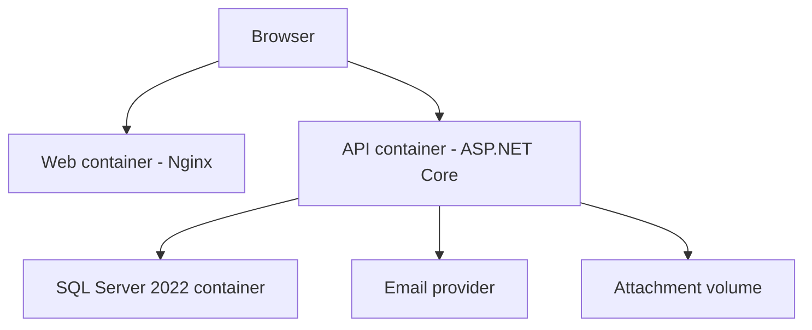

### Local Docker startup

```powershell
Copy-Item infrastructure/docker/.env.example infrastructure/docker/.env
# Set MSSQL_SA_PASSWORD in the copied file
powershell -ExecutionPolicy Bypass -File .\scripts\setup-sqlserver.ps1
```

To run the complete Compose stack after the database environment is configured:

```powershell
docker compose --env-file infrastructure/docker/.env -f infrastructure/docker/docker-compose.yml up --build
```

Local endpoints:

- Web: `http://localhost:5173`
- API: `http://localhost:5141`
- Swagger: `http://localhost:5141/swagger`
- GraphQL: `http://localhost:5141/graphql`

---

## 13. CI/CD Workflow

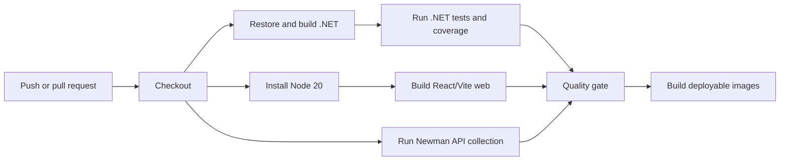

The repository workflow is defined in `.github/workflows/build-test.yml`. Production deployment requires provider-specific secrets, databases, domains, and environment configuration.

---

## 14. Security Requirements

- Passwords are hashed and never stored as plaintext.
- Access tokens are short-lived JWTs.
- Refresh tokens are persisted as hashes and can be revoked.
- Authentication and sensitive operations are rate limited where configured.
- Organization and project boundaries are enforced server-side.
- Current organization membership is checked alongside project membership.
- Guests cannot retain manager-level project access.
- Viewer write operations are denied.
- Archived project collaboration is blocked.
- Attachment downloads require authorized task access.
- File names are reduced to safe file names before storage.
- Secrets must be provided through environment configuration in deployment environments.
- Development signing keys and database passwords must be replaced before production deployment.

---

## 15. Testing Strategy

### Current test surfaces

- API smoke tests under `apps/web/tests`.
- Browser smoke tests using Playwright.
- Team and role-isolation smoke tests.
- Attachment and notification smoke tests.
- Postman/Newman collection under `tests/Pms.ApiTests/postman`.
- .NET unit and integration test projects.
- GitHub Actions build and test workflow.

### Required coverage expansion

1. Unit tests for role and lifecycle rules.
2. Integration tests against SQL Server for EF Core and Dapper.
3. API contract tests for success and failure responses.
4. Tenant-isolation tests between organizations.
5. Role downgrade and inactive-membership tests.
6. Archived-project collaboration tests.
7. GraphQL authentication tests.
8. Attachment access and file validation tests.
9. Frontend component and accessibility tests.
10. CI coverage threshold of at least 80% after meaningful test coverage is established.

---

## 16. Lifecycles

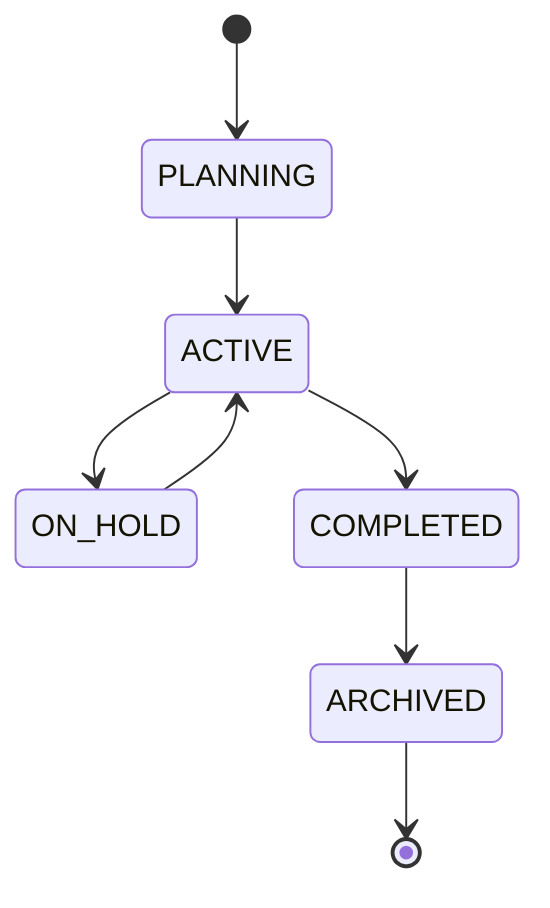

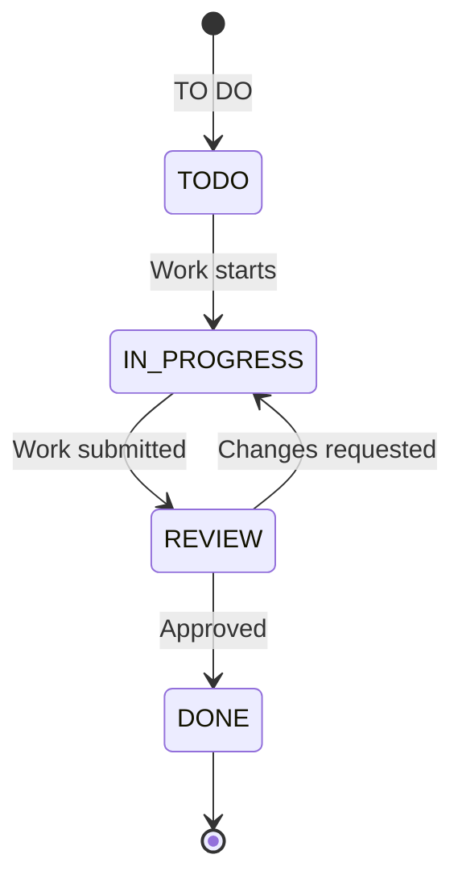

---

## 17. Seven-Week Alignment

| Week | Deliverable | Current status |
|---|---|---|
| 1 | Environment setup and HackerRank SQL/C# practice | External evidence required |
| 2 | SQL Server, procedures, optimized queries, .NET REST, GraphQL, API testing | Core implementation present; test depth still expanding |
| 3 | React/Vite, Material UI, Axios/TanStack Query, Apollo, secure state | Web stack integrated; existing screens remain incrementally migrated |
| 4 | Flutter authentication and mobile integration | Deferred by request |
| 5 | Docker, Compose, Vercel/cloud deployment, CI/CD | Docker and CI foundations present; provider deployment remains environment-specific |
| 6 | Quality engineering, automated suites, accessibility, OWASP, coverage | Foundation present; real test depth and evidence still required |
| 7 | UAT, performance benchmarking, executive quality reporting | Project-specific execution evidence required |

---

## 18. Operational Runbook

### Start the API directly

```powershell
dotnet run --project src/Pms.Api/Pms.Api.csproj --urls http://localhost:5141
```

### Start the frontend directly

```powershell
npm.cmd run dev --prefix apps/web -- --host 127.0.0.1 --port 5173
```

### Build the frontend

```powershell
npm.cmd run build --prefix apps/web
```

### Open Swagger

Navigate to `http://localhost:5141/swagger` while the API is running in Development mode. Use `POST /api/v1/auth/login`, copy the access token, click **Authorize**, and enter `Bearer <token>`.

### Configuration

- `ConnectionStrings__PmsDatabase`: SQL Server connection string.
- `Jwt__SigningKey`: production JWT signing key.
- `Jwt__Issuer`: token issuer.
- `Jwt__Audience`: token audience.
- `VITE_API_URL`: web REST base URL.
- `VITE_GRAPHQL_URL`: web GraphQL URL.

---

## 19. Design-to-Implementation Handoff

1. Approve this consolidated system boundary.
2. Review the ERD against the SQL Server schema.
3. Review role permissions with product stakeholders.
4. Confirm SQL Server as the primary Week 2 database.
5. Complete API contract testing.
6. Expand unit and integration coverage.
7. Add external Figma, Jira, HackerRank, UAT, and performance evidence.
8. Build the deferred Flutter application in Week 4.
9. Configure production cloud environments and secrets.
10. Re-run the diagrams and documentation review as the system evolves.

---

## 20. Source References

- `README.md`
- `docs/implementation-status.md`
- `src/Pms.Api`
- `src/Pms.Application`
- `src/Pms.Domain`
- `src/Pms.Infrastructure`
- `database/sqlserver`
- `apps/web`
- `tests`
- `infrastructure/docker`
- `.github/workflows/build-test.yml`
- Supplied Project Management System architecture, DFD, ERD, sequence diagram, and GTP 2026 Bootcamp documentation
